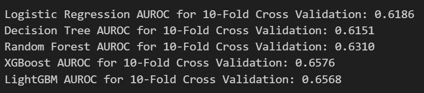
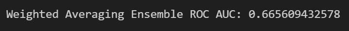

# **Repeat Buyers Prediction Challenge**

More details about the competition can be found here: [Tianchi Competition](https://tianchi.aliyun.com/competition/entrance/231576)


## **Team Members**
- Sakshee Patil
- Iara Ravagni


## **Project Overview**
This project addresses a critical challenge for merchants participating in the "Double 11" sales day: identifying which new buyers are likely to become repeat customers. By leveraging anonymized shopping logs, we aim to predict customer retention and help merchants enhance their promotional strategies, leading to improved ROI and sustainable customer relationships.


## **Dataset**
The dataset includes shopping logs and metadata for users and merchants over six months, enabling us to predict repeat buyers. Key features include:

- **User Profile**: Demographics such as age range and gender.
- **Interaction Logs**: User activities like clicks, add-to-cart events, purchases, and favorites, categorized by item, category, and brand.
- **Target Label**: A binary label (1 for repeat buyer, 0 otherwise) indicating whether a user returned to the same merchant within six months.

The dataset is imbalanced, with relatively few repeat buyers, making it a challenging yet realistic classification problem.


## **Problem Definition**
Merchants invest heavily in promotions but often attract one-time buyers. By identifying potential repeat customers, merchants can personalize marketing efforts and maximize long-term profits. Our objective is to develop predictive models to identify repeat buyers using historical shopping data.


## **Data Pipeline**
Our data processing pipeline was designed to handle large-scale structured data and extract actionable insights:

### 1. **Data Cleaning**
- Missing values were imputed with feature-wise means to preserve dataset integrity.
- Categorical features were encoded using one-hot or ordinal encoding as appropriate.

### 2. **Feature Engineering**
We crafted features that capture user behavior, diversity, and preferences, including:
- **Behavioral Patterns**: Frequency of purchases, clicks, and add-to-cart actions.
- **Merchant Interactions**: Number of unique merchants interacted with.
- **Category and Item Preferences**: Dominance of certain product categories in user interactions.
- **Temporal Features**: Activity spikes during promotional periods.

### 3. **Scaling**
All numerical features were standardized using `StandardScaler` to improve model convergence and ensure uniformity across features.

### 4. **Feature Selection**
We conducted correlation analysis and feature importance evaluation (via tree-based models) to retain features with high predictive value.

### 5. **Data Splitting**
The dataset was split into training (80%) and validation (20%) sets using stratified sampling to maintain class balance.


## **Models**
We implemented and compared two approaches: non-deep learning models and a deep learning model.

### **1. Non-Deep Learning Model**
We built an ensemble of:
- **Logistic Regression**: A baseline model to interpret feature contributions.
- **Decision Tree**: Tree-based model to capture non-linear relationships.
- **Random Forest**: A robust tree-based model to capture non-linear relationships.
- **XGBoost**: An advanced gradient boosting framework for optimal performance on structured data.
- **LightGBM**: Another advanced gradient boosting machine for optimal performance on structured data.





### **2. Deep Learning Model**
We implemented a feedforward neural network using PyTorch:
- **Architecture**: A fully connected network with 3 hidden layers of sizes [128, 64, 32].
- **Activation**: ReLU for non-linearity and Sigmoid for binary classification.
- **Optimization**: Adam optimizer with weight decay to prevent overfitting.
- **Loss Function**: Binary Cross-Entropy Loss for probabilistic outputs.


We conducted hyperparameter tuning (learning rates, layer sizes, dropout rates) and experimented with early stopping to enhance generalization.


## **Evaluation Strategy**
Given the class imbalance, **AUROC** (Area Under the Receiver Operating Characteristic Curve) was chosen as the primary metric:
- **Why AUROC?** It evaluates the model's ability to distinguish between classes, independent of thresholds, making it ideal for imbalanced datasets.
- **Business Context**: AUROC allows merchants to set actionable thresholds based on specific marketing goals (e.g., prioritizing high recall or precision).

We employed 5-fold cross-validation to ensure that the models generalized well across different data splits.

---

## **Results**
- **Non-Deep Learning Model**: Delivered strong baseline performance, with XGBoost achieving the highest validation AUROC. However, since AUROC values for almost all models were higher than 0.62, decided to generate a weighted ensemble approach. Combining predictions from all models further boosted the model's robustness to ~0.67 AUROC with the top AUROC on the leaderboard being 0.7.

- **Deep Learning Model**: Achieved slightly less AUROC (0.61) and it also required significant hyperparameter tuning and computational resources.


## **Expected/Unexpected**
- **Non-Deep Learning Model**: The models performed as expected, achieving AUROC close to 0.6 - 0.65 which aligns with the values on the leaderboard on which the highest is 0.7. Given the dataset's complexity and the methods employed (e.g., feature engineering, hyperparameter tuning), the results are within the anticipated range.


- **Deep Learning Model**: The model performed below expectations, achieving AUROC of 0.61, which is lower than anticipated. This is most likely due to issues such as insufficient feature quality.

## **What can be done to improve?**
- **Address Class Imbalance**: Consider techniques like SMOTE or class weighting if thesince the dataset is imbalanced.

- **Try More Models and Technqiues**: Test more algorithms, such as pre-trained deep learning models or include even more model in ensembling, to see if there’s an improvement.

- **Enhance Feature Engineering**: Further explore new features or transformations (e.g., polynomial features, interaction terms) that may better capture the underlying patterns.


## **How to Run**
To reproduce our results, follow the steps below:

### 1. **Download the Dataset**
1. Visit the [Tianchi Competition Page](https://tianchi.aliyun.com/competition/entrance/231576).
2. Download the dataset (`data_format1.zip`) and extract it to a folder named `data_format1` in the project directory.

### 2. **Set Up the Environment**
Use a virtual environment to manage dependencies:
```bash
# Create a virtual environment
python -m venv env

# Activate the virtual environment
# On Windows:
env\Scripts\activate

# On macOS/Linux:
source env/bin/activate
```

### **3. Install Dependencies:**
Ensure you have the required libraries installed:
```bash
pip install -r requirements.txt
```

### **4. Usage**
```bash
python pipeline.py
```
